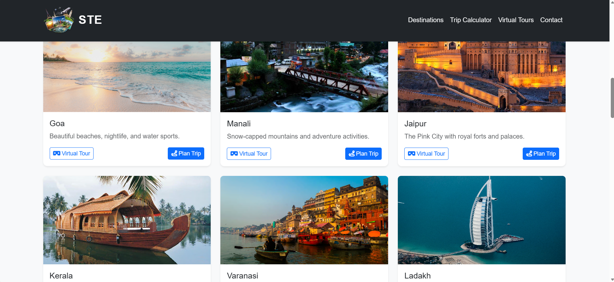
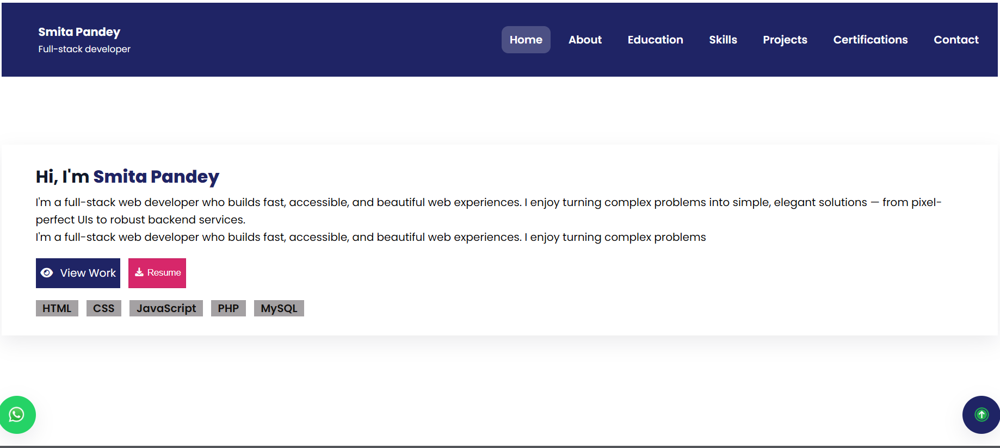
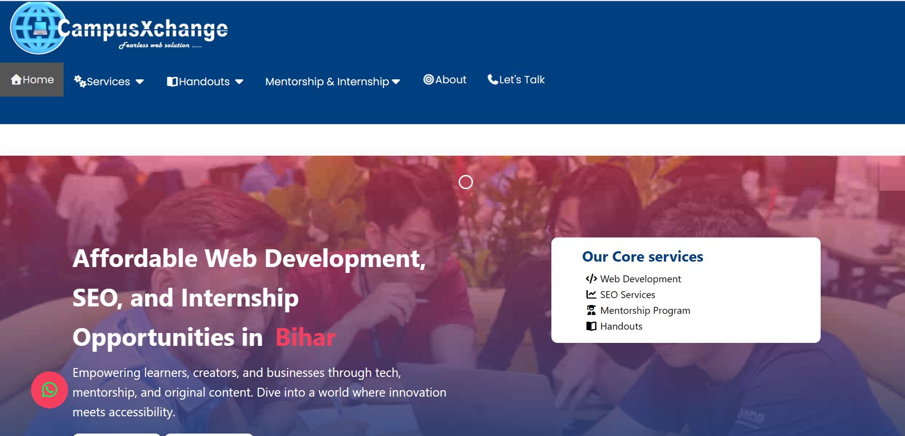

# My-Clients-Project-Showcase

A private showcase of web development projects created for clients, highlighting custom solutions built using HTML, CSS, JavaScript, PHP, and MySQL. Each project is designed with client requirements in mind, focusing on responsive layouts, clean design, and functional features.

---

<table>

  <thead>
    <th>Project Preview</th>
    <td>Title/Name</td>
    <th>Live Demo</th>
  </thead>

  <tbody>
    <tr>
      <td width="33%" >  </td>
      <td width="33%" > Paramount coaching website</td>
      <td width="33%" > <a href="https://pankajdas0025.github.io/Paramount-Coaching-Centre/" >🌐 Live View </a></td>
    </tr>
        <tr>
      <td width="33%" >  </td>
      <td width="33%" > Smart Explorer</td>
      <td width="33%" > <a href="https://youtu.be/7fPNNUCMgos?si=JQ21ReMsjf5yQqDt" >🌐 Live View </a></td>
    </tr>
        <tr>
      <td width="33%" >  </td>
      <td width="33%" > Smita Portfolio Website</td>
      <td width="33%" > <a href="https://pankajdas0025.github.io/Paramount-Coaching-Centre/" >🌐 Live View </a></td>
    </tr>
    <tr>
      <td width="33%" >  </td>
      <td width="33%" > Campusxchange Services </td>
      <td width="33%" > <a href="https://campusxchange.wuaze.com/home" >🌐 Live View </a></td>
    </tr>
    
  </tbody>
</table>

## Features

- **Client-Focused Solutions:** Projects developed according to specific client needs.
- **Responsive & Modern Design:** Works seamlessly on desktops, tablets, and mobile devices.
- **Clean & Organized Code:** Easy to maintain and extend.
- **Tech Stack:** HTML, CSS, JavaScript, PHP, MySQL.

---

## License

**GitHub Proprietary License**

All rights are reserved. You **may not** copy, modify, distribute, or use any of the code without explicit permission. This ensures the privacy and security of all client projects.

